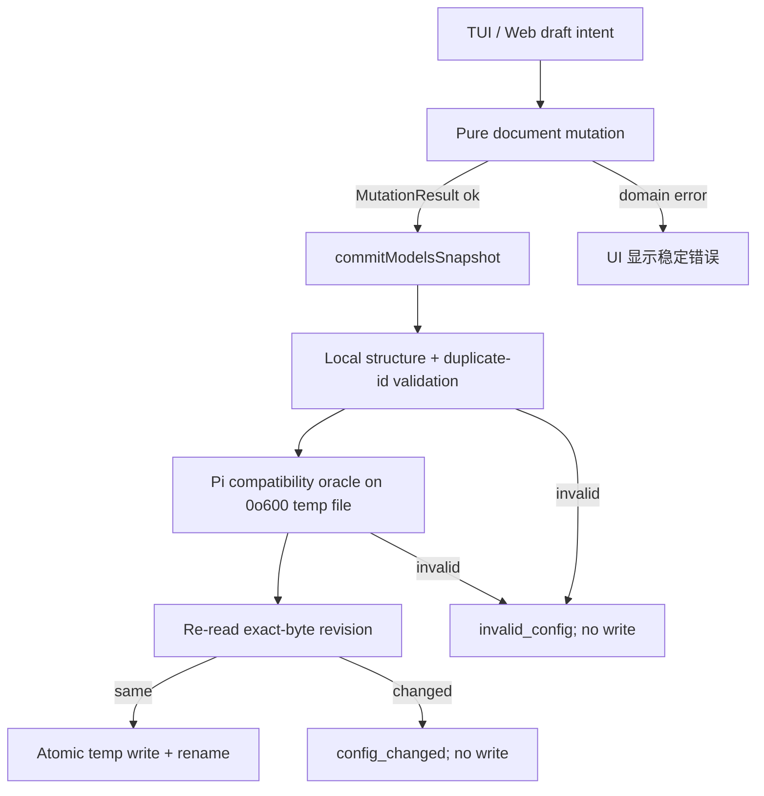

# vendor-config-core Design

## 0. 术语约定

- **Models document**：`models.json` 的完整 JSON 对象；允许 Pi 当前 schema 未声明的未知字段，除非当前 Pi compatibility oracle 拒绝。
- **Document mutation**：不做 IO 的 provider/model create、rename、delete、replace 纯变更；统一返回 `MutationResult`。
- **Config revision**：`missing` 或原始文件 UTF-8 bytes 的 `sha256:` + 64 lowercase hex；browser 只做 opaque round-trip。
- **Pi compatibility oracle**：用当前运行 Pi 的公共 `ModelRegistry.create(AuthStorage.inMemory(), tempPath).getError()` 判断 candidate 是否能被 Pi 加载。
- **Conditional commit**：candidate 校验通过且磁盘 revision 等于 expected revision 时，才执行同目录 atomic rename。

代码中已有 `ModelsJson`、`ProviderConfig`、`ProviderModelConfig`，本 feature 沿用这些名称，不新造 repository/entity 术语。

## 1. 决策与约束

### 1.1 需求摘要

本 feature 为后续 TUI 与 Web 提供唯一配置语义：

- 不打开 UI 即可安全读写完整 Models document。
- provider/model identity 变更默认拒绝碰撞，显式确认后才能覆盖。
- 保存前以当前 Pi 为最终兼容性真相源。
- 陈旧 draft 不得静默覆盖磁盘新内容。
- 未修改字段（含未知字段）与原本缺失字段保持原状。

成功标准：roadmap §4.1/4.2 的接口、错误码和 invariant 有可运行 contract tests，且现有 package test/typecheck 全绿。

### 1.2 明确不做

- 不实现 Web server、SecretRef、浏览器 draft 或 TUI 菜单。
- 不请求 official catalog 或远端 `/models`，不解析/执行 config command。
- 不提供严格跨进程锁；revision 是已明确上限的乐观冲突检测。
- 不复制 Pi 私有 TypeBox schema，不解析其私有错误文本为字段级错误。
- 不顺手修其他 package 或改变 Pi 自身模型加载行为。

### 1.3 复杂度档位

走本地配置管理默认档位；由于会写凭证配置，数据完整性与错误 fail-closed 提升为硬约束，无性能、高并发或分布式偏离。

### 1.4 关键决策

1. **先冻结纯 document/mutation，再接 IO**：A 块可在 browser bundle 与 Node 共用；B 块处理 snapshot/oracle/revision/commit。两块分别验收，仍作为一个 cohesive feature 交付。
2. **MutationResult，不抛 identity 业务异常**：六个 mutation 用 discriminated union；read/commit 保持 roadmap 的裸返回签名，但只允许抛带稳定 code 的 `ConfigCoreError`，禁止裸 `Error` 穿透。
3. **当前 Pi 公共 API 是 oracle**：内部窄 seam `type PiOracle = (path: string) => string | undefined`；test-only/internal factory 以依赖参数注入 oracle/filesystem，public wrapper 使用 production defaults，不使用模块级可变变量。Production 包住 `AuthStorage.inMemory`、`ModelRegistry.create`、`getError` 的全部异常；返回文本映射 `pi_incompatible`，构造/执行异常映射 `validator_unavailable`。
4. **未知字段不 strip**：Pi 0.79.10 characterization 已证明 root/provider/model 三层未知字段可通过；未来 Pi 拒绝时返回 `pi_incompatible`，不删除后重试。
5. **身份规则**：UI intent 的 key/id trim 后非空、大小写敏感；create/add 冲突拒绝；rename/replace 只有 `overwrite-confirmed` 可覆盖；delete missing 返回 not-found。
6. **最小 seam**：文件路径参数提供 local-substitutable test surface；不增加单实现 repository/interface。
7. **兼容下限**：`@earendil-works/pi-coding-agent` peer 调整为 `>=0.79.10`；`pi-tui` 不使用新 API，不抬下限。
8. **Config error 与 mutation error 分离**：`ConfigCoreError` 只含 `invalid_config | invalid_revision | config_changed | read_failed | write_failed | validator_unavailable`，可携带 `issues/path`，message 必须脱敏；HTTP adapter 后续负责映射状态码。
9. **Config-value 只做语法分类**：导出 `type ConfigValueClass = "literal" | "env-reference" | "command"` 与 `classifyConfigValue(value: string): ConfigValueClass`，供后续 SecretRef/model source 共用；不读取 env、不执行 command。

### 1.5 Top 3 风险与证据计划

1. **字段被隐式补齐或丢失**：三层 unknown、missing `models`、built-in override 做 exact object assertions。
2. **碰撞导致静默覆盖/顺序漂移**：provider rename/model replace 的 reject、confirmed overwrite、relative ordering 由纯 contract tests 证明。
3. **校验后仍写坏或覆盖陈旧文件**：invalid oracle/stale revision 均断言目标 bytes 不变；成功断言 trailing newline、`0o600`、新 revision。

非显然依赖：当前 Pi 0.79.10 的 `ModelRegistry`/`AuthStorage` 公共 API；最低版本 fixture 在 package/CI 收口中验证。

关键假设：`ModelRegistry.create()` 加载 candidate 不修改当前运行 session；实现前用 characterization test 核验，若不成立则停回 roadmap，而不是改用私有 validator。

### 1.6 实际变更边界

**必须交付**：environment-free document/mutation 模块、snapshot/oracle/commit 模块、公开 exports、coding-agent peer 下限、对应 contract/filesystem tests。

**本 feature 不迁移**：`command.ts`、`provider-menu.ts`、`models-menu.ts` 仍暂时使用 legacy read/upsert/write；真正迁移分别归 `vendor-web-modal-runtime` 与 `vendor-tui-quick-workflows`。因此本 feature 的 DoD 只要求新 caller 必须使用新 core，不宣称整个现有 package 已消除 legacy 绕过。旧入口风险保留到 TUI quick acceptance。

## 2. 名词与编排

### 2.1 名词层

#### 现状

- `models-json.ts` 同时定义类型、draft、读写与 provider upsert；`normalizeProviderConfig()` 会把缺失 `models` 补成 `[]`。
- `model-list.ts` 以 index/upsert 操作 model；同 id 会隐式替换，replace 到已有 id 会静默合并。
- `readModelsJson()` 只做根/provider 粗校验；`writeModelsJson()` 已有同目录 temp + rename + `0o600`，但没有 revision 或 Pi compatibility。

#### 变化

对外冻结 roadmap §4.1/4.2 的类型：

```ts
// 来源：roadmap vendor-dual-ui-manager §4.1/4.2
type ConfigErrorCode =
  | "invalid_config" | "invalid_revision" | "config_changed"
  | "read_failed" | "write_failed" | "validator_unavailable";

class ConfigCoreError extends Error {
  readonly code: ConfigErrorCode;
  readonly path?: string;       // RFC 6901 JSON Pointer
  readonly issues?: ConfigIssue[];
}

type PiOracle = (path: string) => string | undefined; // internal factory dependency, not mutable global

readModelsSnapshot(path?: string): ModelsSnapshot; // throws ConfigCoreError only
validateModelsJson(models: unknown): ConfigIssue[]; // only local root/providers/duplicate-id rules; no IO/oracle
commitModelsSnapshot({ models, expectedRevision }, path?): ModelsSnapshot; // throws ConfigCoreError only

type MutationResult<T> =
  | { ok: true; value: T }
  | { ok: false; error: MutationError }; // MutationError.path is RFC 6901

createProvider(...): MutationResult<ModelsJson>;
renameProvider(...): MutationResult<ModelsJson>;
deleteProvider(...): MutationResult<ModelsJson>;
addModel(...): MutationResult<ModelsJson>;
replaceModel(...): MutationResult<ModelsJson>;
deleteModel(...): MutationResult<ModelsJson>;
```

Known typed schema 至少显式包含 roadmap descriptors：provider 的 `name/baseUrl/api/apiKey/headers/authHeader/compat/modelOverrides/models`，model 的 `id/name/api/baseUrl/reasoning/thinkingLevelMap/input/cost/contextWindow/maxTokens/headers/compat`。`modelOverrides` 使用 `Record<string, { name?; reasoning?; thinkingLevelMap?; input?; cost?; contextWindow?; maxTokens?; headers?; compat? }>`，而不是落回 `unknown`。descriptor 只描述 UI 可表达字段，不负责复制/过滤完整 document；index signature 继续无损承载 unknown fields。

##### Interface 设计检查

- **Module**：Document mutation（全新/替代旧 upsert UI 入口）+ Config snapshot/commit（改造现有 models-json）。
- **Interface facts**：mutation 无 IO、返回新对象；commit 顺序固定为 validate → re-read revision → atomic write；任何失败不写。
- **Seam**：所有 UI document 变更穿过 mutation；所有保存穿过 conditional commit。
- **Depth / locality**：trim、碰撞、ordering、oracle、revision、权限集中，删除模块会把复杂度重新散到 TUI/Web。
- **Dependency strategy**：mutation=in-process；filesystem=local-substitutable；Pi oracle=installed dependency。
- **Adapter**：无 repository adapter；真实 path 和 temp path 已足够测试。
- **Test surface**：roadmap §4.1/4.2 的全部 invariant 都从公开函数观察。
- **Descriptor kinds**：`modelOverrides/headers/compat/cost/thinkingLevelMap` 使用 `kind: "json"`；descriptor 是 UI metadata，不执行 schema filtering。
- **Error mode**：mutation 使用 result；snapshot/commit 只抛 `ConfigCoreError`。调用方不解析 message，统一按 code/path/issues 分支。
- **JSON domain**：Models document 只承诺 JSON-compatible value；不支持 `undefined`、Date、Map、循环引用等进程内对象。

### 2.2 编排层



#### 现状

`command.ts` 读取 whole document，TUI draft 内直接调用旧 upsert，保存前重新读取后覆盖 provider。模型操作独立处理数组；配置兼容性直到用户打开 `/model` 才由 Pi 发现。

#### 变化

- Document mutation 成为后续 TUI/Web 新 caller 的唯一 identity 变更入口；现有 `/vendor` legacy caller 本 feature 不迁移，并在 1.6 明确风险归属。
- Snapshot 先读取原始 `Buffer` 并直接计算 SHA-256，再用 fatal UTF-8 decode + strict `JSON.parse`；missing file 只返回逻辑 `{providers:{}} + missing`，read 不创建文件。
- Commit 先检查 revision 是否匹配 `/^sha256:[0-9a-f]{64}$/` 或 `missing`，再运行本地规则与安全临时文件 oracle，随后重新比较磁盘 revision，最后 atomic write。
- 本地规则仅含：root 为非数组 object、`providers` 存在且为非数组 object、可识别 models array 中的精确 duplicate string id；其余 provider/model shape 全交 Pi oracle 并映射 `pi_incompatible`。
- 成功返回新 snapshot；registry refresh 由更外层 command orchestration 负责，不属于 core。

#### 流程级约束

- Models document 仅含 JSON-compatible value；所有 mutation 返回 JSON-deep clone，不能修改输入。
- `overwrite-confirmed` 由 UI 确认后显式传入；core 不弹窗。
- Replace ordering tests 固定：`[source,x,target,y]` 与 `[target,x,source,y]` confirmed overwrite 均得到 `[replacement,x,y]`；source=target、target missing 另测。Provider object insertion order 不纳入契约。
- Oracle temp 与 commit temp 使用不同前缀 + 128-bit 随机 suffix、同目标目录创建、显式 `0o600`；write/oracle/rename 任意失败都在 `finally` 清理，文件名和原值不进入错误消息。
- Strict JSON 是本 feature 的读取边界：非 UTF-8、BOM、comments、malformed JSON 返回 `read_failed`/`invalid_config` 且不写。Pi 对 comments 的额外兼容不在本 feature；成功 commit canonical `JSON.stringify(..., null, 2) + newline`，只保证 JSON value 无损，不保证原空白/comment bytes。

错误优先级固定为：① expected revision 格式非法 → `invalid_revision`；② candidate 本地/Pi 校验失败 → `invalid_config` / `validator_unavailable`；③ 当前文件 re-read 失败 → `read_failed`；④ current revision 不等 expected（含 expected=`missing` 但文件已存在）→ `config_changed`；⑤ temp write/rename 失败 → `write_failed`。Oracle 期间外部修改不会改变该顺序，最终 re-read 仍负责 stale 检测。

### 2.3 挂载点清单

- package public exports：`src/index.ts` — 新增 snapshot/validation/mutation/descriptor/classifier 导出。
- npm peer contract：`packages/pi-vendor/package.json` — coding-agent 下限改为 `>=0.79.10`。

现有 `/vendor` command 不是本 feature 挂载点；它在 `vendor-tui-quick-workflows` 迁移前仍是已记录 residual risk。

### 2.4 推进策略

1. 纯文档契约：实现 typed mutation/descriptor，并用 table-driven tests 冻结 identity 语义。
2. Pi compatibility：实现临时文件 oracle 与 shape/unknown/duplicate characterization。
3. Snapshot：接入 exact-byte revision 与 missing/read error 语义。
4. Conditional commit：串起 validate、revision compare、atomic `0o600` write 与清理。
5. 兼容收口：更新 public exports、typed known fields、config-value classifier、coding-agent peer 和最低版本 fixture；保留 legacy callers 但禁止新 caller 使用旧 upsert。

### 2.5 结构健康度与微重构

#### 评估

- 文件级 — `models-json.ts`：约 128 行，职责包含类型/draft/IO/upsert，但仍围绕单一配置文档；本 feature 会新增较多 IO 契约，不应继续把纯 mutation 塞入该文件。
- 文件级 — `model-list.ts`：约 33 行，职责单一；旧 index/upsert 语义需迁移但文件本身不胖。
- 目录级 — `src/`：17 个同层文件，本次预计新增两个同领域模块，触发摊平检查；现有包按能力文件平铺，立即重组会移动大量无关 UI/catalog 文件。

#### 结论：不做独立微重构

实现时把 environment-free document mutation 与 IO snapshot/commit 放在职责分离的新模块，不移动无关现有文件、不建立 `config/` pass-through 目录。旧函数迁移属于本 feature 语义变更，不伪装成“只搬不改行为”的前置重构。

## 3. 验收契约

### 3.1 关键场景

1. missing path → 只返回逻辑 `{providers:{}}`、revision=`missing`，磁盘仍不存在。
2. 未知 root/provider/model 字段 → oracle 通过且 commit round-trip exact value。
3. provider 缺失 `models` → 读取/无关 mutation/保存后仍不出现 `models`。
4. `{}` / invalid providers、duplicate string id → 本地 `invalid_config`；其余 provider/model shape 与 Pi 语义非法 → oracle `pi_incompatible`；全部零写入。
5. create/add 已存在 → typed exists error；rename/replace 默认冲突拒绝。
6. `overwrite-confirmed` ordering matrix：source-before-target、target-before-source 均得到 replacement 占 source 位置且 unaffected 顺序保持；source=target/target missing 分别验证。
7. delete/replace missing、trim 后空 key/id →稳定 typed error，无输入 mutation。
8. malformed expected revision → `invalid_revision`；stale expected revision → `config_changed`；均不写。
9. valid current revision → commit temp 随机唯一且全程 `0o600`，最终 canonical JSON + trailing newline、atomic replacement，并返回落盘 Buffer 的新 hash。
10. oracle create/getError、UTF-8/JSON read、temp write、rename failure →稳定 ConfigCoreError、所有 temp 清理、消息不含 document/secret/temp basename。
11. Pi peer 最低版本 fixture → typecheck + oracle characterization 通过。
12. `classifyConfigValue` 只按 Pi config syntax 区分 literal/env-reference/command，不读取 env、不执行命令。
13. 当前 legacy `/vendor` 仍可运行但不属于本 feature 安全保证；新 exports/callers 不引用旧 upsert。

### 3.2 明确不做的反向核对

- 不出现 HTTP/browser/TUI component 依赖。
- 不执行 `!command`、env resolution 或远端 fetch。
- 不新增 cross-process lock 或宣称 revision 是 CAS/锁。
- 不 import Pi 私有 validator，不承诺读取 JSONC/comments/BOM。

### 3.3 Acceptance Coverage Matrix

| Scenario | Covered By Step | Evidence Type | Command / Action | Core? |
|---|---|---|---|---|
| Mutation identity/conflict/ordering | S1 | unit test | vendor test | yes |
| Pi oracle + unknown/invalid/duplicate | S2 | characterization test | vendor test | yes |
| Missing/exact-byte revision | S3 | filesystem test | vendor test | yes |
| Stale vs successful atomic commit | S4 | filesystem integration test | vendor test | yes |
| Raw Buffer/strict JSON/random temp cleanup | S3 / S4 | filesystem failure injection | vendor test | yes |
| Exports/typed fields/classifier/peer minimum | S5 | typecheck + fixture | package/workspace commands | yes |
| No UI/network/private validator | S5 | diff review | grep/import review | no |

### 3.4 DoD Contract

| ID | 要求 | 证据 | 阻塞级别 |
|---|---|---|---|
| DOD-DESIGN-001 | roadmap §4.1/4.2 每个接口和 invariant 均有 checklist 映射 | design review | blocking |
| DOD-IMPL-001 | 两个验收块与全部 steps 完成 | checklist + tests | blocking |
| DOD-REVIEW-001 | code review passed，无 unresolved blocking | review report | blocking |
| DOD-QA-001 | package/workspace commands 与核心场景全绿 | QA report | blocking |
| DOD-ACCEPT-001 | acceptance 核验 exports/peer/roadmap 回写 | acceptance report | blocking |

Validation Commands:

| ID | 命令 | 目的 | 核心性 | 失败处理 |
|---|---|---|---|---|
| CMD-001 | `npm --workspace @bytetrue/pi-vendor test` | mutation/oracle/filesystem contracts | core | fix-or-block |
| CMD-002 | `npm --workspace @bytetrue/pi-vendor run typecheck` | public types 与 Pi API | core | fix-or-block |
| CMD-003 | `npm run typecheck --workspaces --if-present && npm test` | workspace 回归 | supporting | fix-or-block |

Required Artifacts: design-review、implementation evidence、code review、QA、acceptance。

### 3.5 自我批判结论

- 将原先过宽的 core 分成两个**验收块**而非增加 pass-through feature；接口先后明确。
- 最弱依赖是 Pi oracle；提前在 S2 验证，不拖到最终 commit。
- 每个 identity/IO 失败均有 yes/no 证据，未使用“安全/稳定/完善”弱词。
- revision 竞态上限与未知字段未来兼容风险均显式保留，不夸大保证。
- Roadmap 要求未来所有 UI 穿过 core，但本 feature 明确不迁移 legacy `/vendor`；风险由后续 TUI quick item 接管，避免本 feature 偷带 UI 重构。
- ConfigCoreError、PiOracle fake、raw Buffer 与 random temp 让 read/oracle/write 失败可独立注入，不靠一个大 happy-path 测试掩盖。

## 4. 与项目级架构文档的关系

本 feature 会形成跨 TUI/Web 稳定使用的 Config core 契约。实现与 acceptance 证明后，应评估用 `cs-domain` 记录“当前 Pi oracle + whole-document conditional commit + typed mutation”的 ADR；当前 requirements/CONTEXT 尚不存在，不在 design 阶段创建。
