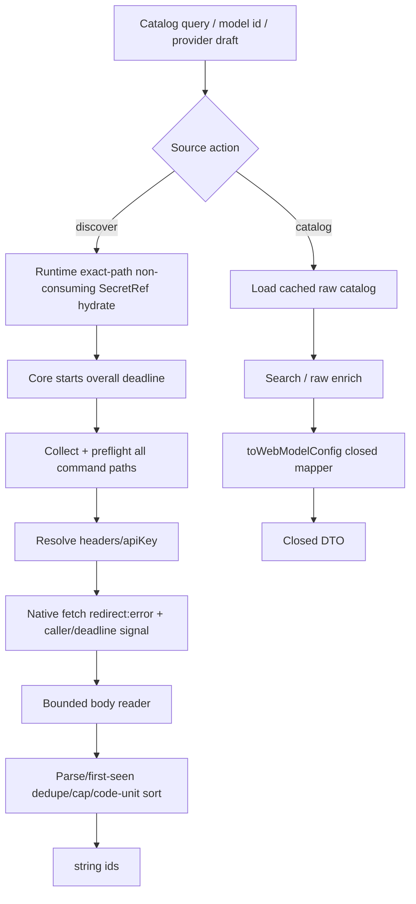

# vendor-model-source-core Design

## 0. 术语约定

- **Raw official model**：Pi 安装目录 catalog 中的开放对象，可包含 routing、credential 和未来未知字段，只允许 Node 内部使用。
- **Web model DTO**：逐字段构造的封闭 `WebModelConfig`；不含 `baseUrl/headers/apiKey/authHeader`、routing 或未知字段。
- **Model source**：local official catalog、local template/default、remote OpenAI-compatible `/models` 三类 model id/config 来源。
- **Trusted command path**：本次 Web session 初始 snapshot 中 `apiKey` 或某个 exact `headers.<name>` 的原始 `!command` 字符串；provider/path/value 任一变化即不可信。
- **Bounded reader**：从 Response body stream 逐 chunk 计 decoded bytes，超限/abort 时 cancel，再 decode/parse。

## 1. 决策与约束

### 1.1 需求摘要

建立一个不写 `models.json` 的共享 Model source core：

- TUI 能搜索/选择完整 official candidate，并继续使用模板/default enrichment。
- Web 只能收到递归封闭的 catalog/enrichment DTO。
- `/models` discovery 正确解析 config values/header/Bearer，并有 deadline、body、count、id、redirect 与 abort 边界。
- 未保存的新/修改 `!command` 绝不执行；错误不回显 secret、命令输出或 upstream body。
- Web runtime 增量获得 catalog/enrich/discover routes，但本 feature 不实现页面。

### 1.2 明确不做

- 不修改 provider/model document、不调用 conditional commit、不刷新 registry。
- 不实现 Web model table、批量选择或 TUI quick 菜单。
- 不支持 OpenAI `/models` 以外的发现协议，不跟随 redirect。
- 不把 raw official object、未知 compat/routing 或 provider credential 发送给 browser。
- 不把未保存 browser draft 的新 command 当作 capability token 执行。

### 1.3 复杂度档位

外部网络/命令执行边界采用高安全档位；catalog search 和 enrichment 为本地低并发。所有上限固定，不加用户配置开关。

### 1.4 关键决策

1. **Raw/DTO 双类型**：现有 Node enrichment 可保留 raw candidate；HTTP 只返回 `toWebModelConfig()` 后的封闭类型。
2. **Closed recursive mapper**：每个 Web field runtime validate + reconstruct；包括安全已知 `cost.tiers` 与 `compat.zaiToolStream/supportsTemperature/allowEmptySignature`，fixture 对齐当前 Pi catalog；禁止 spread/cast/unknown passthrough，仍移除 routing/credential。
3. **Local catalog search**：query 按 UTF-8 bytes ≤512，limit default=50、1–100；TUI/Web 共用同一 bounded search，非法输入稳定报错。
4. **Exact Pi-style parser**：raw value 不 trim；仅 byte 0 `!` 为 command，runner 收 `slice(1)`；template 支持 mixed/greedy `$VAR`、`${VAR}`、`$$`、`$!`，malformed/unclosed ref 作 literal，literal whitespace保留；provider env truthy值优先，随后 `process.env` truthy值，empty/missing unresolved；command uncached。
5. **All-command preflight before execution**：先收集固定 surface（apiKey + exact header names）的全部 raw command paths，用 structured path + raw equality 校验 initialProvider；任一不可信则 runner调用0次。全部通过后才依固定顺序resolve。
6. **Core-owned overall budget**：`discoverModelIds` 进入 credential resolution 时创建唯一15s deadline并组合caller signal；route不创建第二timer。command实际上限 `min(10s, remaining)`、stdout64KiB；优先级 caller abort > overall deadline > command local failure > fetch/parse。
7. **Streaming fetch seam**：新 `BoundedFetchResponse.body` 替代 json-only FetchLike；deadline 15s、decoded 2 MiB、10k ids、1 KiB/id、redirect error，external abort 优先。
8. **Auth 组合**：先解析 headers；已有大小写不敏感 Authorization 时保留，否则解析 apiKey 添加 Bearer。`authHeader:true` 要求 key；false 不禁用 OpenAI 标准 Bearer。
9. **Runtime route adapter**：item直接依赖 Web runtime；route从session non-consuming hydrate provider apiKey/headers SecretRefs，initial raw snapshot是command trust source。Request disconnect组合caller signal；失败只结束请求、draft/session保留。

### 1.5 Top 3 风险与证据计划

1. **Catalog 敏感字段穿透 DTO**：fixture 注入顶层/嵌套 secret/unknown，序列化后递归扫描禁止 key。
2. **远端或 command 挂死/耗尽 Pi**：slow first byte/read、oversize、10k+、long id、command timeout/output、external cancel 全部 fake stream/runner 测试。
3. **认证送错 origin/path**：http/https-only、redirect error、Authorization precedence、changed command fail closed 由 request capture tests 证明。

非显然依赖：`vendor-config-core` classifier/types；`vendor-web-modal-runtime` route registration seam；Pi official catalog 当前内部布局。

关键假设：model id 是用户可见 identifier，不视为 secret；warning 可回显原 modelId，但不含 resolver/upstream 内容。

## 2. 名词与编排

### 2.1 名词层

#### 现状

- `official-catalog.ts` 解析 Pi 安装路径并返回开放 `OfficialModelConfig`，只删除五个顶层 routing 字段。
- `enrich.ts` 的 ambiguous result 携带 raw candidates；ready result 是带 index signature 的 `ProviderModelConfig`。
- `openai-models.ts` 只支持 literal/纯 env ref，总是 Bearer，使用 `response.json()`，没有 signal/timeout/body/count/redirect budget。
- 相关模块与 tests 平铺在已经拥挤的 `src/`。

#### 变化

Roadmap §4.3 类型直接成为 public contract：

```ts
type OfficialModelChoice = {
  provider: string;
  modelId: string;
  model: WebModelConfig;
};

type WebModelEnrichmentResult =
  | { kind: "ready"; source: "official" | "template" | "default";
      model: WebModelConfig; warning?: string }
  | { kind: "official-candidates"; modelId: string;
      candidates: OfficialModelChoice[] };

type ModelSourceErrorCode =
  | "invalid_request" | "catalog_unavailable" | "credential_unresolved"
  | "upstream_timeout" | "upstream_too_large" | "upstream_failed" | "aborted";

class ModelSourceError extends Error {
  readonly code: ModelSourceErrorCode;
  readonly status?: number; // only sanitized non-2xx integer; no URL/body/statusText
}

searchOfficialModels(query: string, limit?: number): Promise<OfficialModelChoice[]>;
enrichModelForWeb(modelId: string): Promise<WebModelEnrichmentResult>;
enrichModelForTui(modelId: string): Promise<ModelEnrichmentResult>;
discoverModelIds(provider: ProviderConfig, options: DiscoverOptions): Promise<string[]>;
```

`enrichModelForWeb()` 内部调用 raw enrichment，并在返回前完成 `toWebModelConfig()`；HTTP adapter 不接触开放 model。
`enrichModelForTui()` 是 Node-only raw candidate API；它不跨 HTTP。调用方写入前仍使用 shared routing strip/clone helper。Catalog `limit` 计算 flat `OfficialModelChoice` 数量。

Internal seams：

```ts
type CredentialPath =
  | { kind: "apiKey" }
  | { kind: "header"; name: string };

type CommandRunner = (commandBody: string, options: {
  signal: AbortSignal; timeoutMs: number; maxStdoutBytes: number;
}) => Promise<string>;

type ConfigValueResolver = (value: string, context: {
  path: CredentialPath;
  initialValue?: string;
  providerEnv: Record<string, string | undefined>;
  processEnv: Record<string, string | undefined>;
  signal: AbortSignal; runCommand: CommandRunner;
}) => Promise<string>;

type DiscoverOptions = {
  initialProvider?: ProviderConfig;
  providerEnv?: Record<string, string | undefined>;
  signal?: AbortSignal;
  fetchImpl?: BoundedFetch;
  runCommand?: CommandRunner;
};

// Production adapters may throw anything; the core catches and rethrows only ModelSourceError.

##### Interface 设计检查

- **Module**：Model source core（改造现有 catalog/enrich/openai modules）。
- **Interface facts**：Web outputs closed；TUI raw outputs stay Node-only；discover bounds fixed；command exact path trust；request cancel non-terminal。
- **Seam**：catalog loader local-substitutable；fetch/command true external with production+fake；route adapter separates HTTP status from domain error。
- **Depth / locality**：credential resolution、budget、DTO projection、catalog layout 集中，caller 只处理 ids/choices/stable errors。
- **Dependency strategy**：catalog local-substitutable；fetch/command true external；route in-process。
- **Adapter**：production native fetch/child process + test stream/runner fakes，都有真实替换需求。
- **Test surface**：closed DTO serialization、captured request、stream cancellation、command trust matrix、route status mapping。

### 2.2 编排层



#### 现状

TUI 直接读取 raw catalog 并自行 fuzzy/group；Web 尚无 route。Remote fetch 把完整 JSON 交 `response.json()`，env resolver 只认整个字符串是 `$VAR`，错误常含 endpoint/status。

#### 变化

- Catalog 加 bounded query API，同时保留 Node raw helper供 TUI internal。
- Web enrichment 在 core 内完成 DTO projection；unknown/nested routing 不到 route。
- Web route用session map non-consuming hydrate provider apiKey/headers；invalid ref时runner/fetch为0。Initial raw provider作command trust；providerEnv由 `ctx.modelRegistry.authStorage.getProviderEnv(providerKey)` server-side传入。TUI adapter使用同一source；browser不能声明trusted/env。
- `discoverModelIds` 自己建立唯一15s overall deadline；route只把 request disconnect signal传入，TUI/Web得到相同预算。Command local上限取 min(10s, remaining)。
- Core先preflight全部command-bearing paths，再resolve；所有 raw adapter exceptions 统一变成typed `ModelSourceError`，message只从本地常量产生。
- Route把 typed error映射HTTP；request `aborted`/response premature close触发controller并在finally卸监听，不settle Web session。

#### 流程级约束

- Search result deterministic；limit计 flat choices，同 score保持catalog first-seen order。
- Catalog unavailable →空 search + enrichment template/default；route state 的 catalogAvailable=false，不视为 server failure。
- Error precedence固定 caller abort > overall deadline > command local timeout/nonzero/64KiB > fetch/read/parse；timer/listener/child/body在finally清理。
- URL 只允许 http/https、拒绝 username/password；在 base pathname 后规范化追加 `/models`，保留用户 base path，不接受浏览器直接传最终 target URL。
- Body bytes按 native fetch 解压后的 stream计；超限立即 reader cancel/release，之后不 parse。
- 3xx 因 `redirect:error` 失败；非 2xx 立即 cancel body 并返回固定 `upstream_failed(status)`，不读取/回显 error body。
- JSON `data` 非数组或无有效 id →空；id trim后 non-empty、UTF-8 ≤1024，non-string/empty/oversize忽略；保留 first-seen 前10,000 unique，其余截断；最后用 `(a < b ? -1 : a > b ? 1 : 0)` code-unit sort。
- `ModelSourceError` 仅允许固定 code、本地safe message与可选非2xx整数status；不含 URL/statusText/headers/command/stdout/stderr/body。
- Command-bearing path集合固定，不扫描任意未知字符串字段。
- Production command runner按 Buffer chunk计64KiB，超限/abort/timeout立即终止子进程；使用 `process.execPath` integration tests验证真实adapter，不只fake。

### 2.3 挂载点清单

- Web runtime route table：新增 `/api/catalog`、`/api/enrich`、`/api/discover` handlers。
- package public exports：新增 closed DTO/search/enrich/discover 与稳定 error types；raw candidate API 标 Node-only。
- Web `/api/state` capability：增加 `catalogAvailable`（不添加 model data）。

### 2.4 推进策略

1. 目录微重构：行为等价移动 model-source 现有模块/tests，保持 exports/TUI tests 绿。
2. DTO/search：实现封闭 mapper、nested allowlist 与 bounded catalog search。
3. Web enrichment：封装 raw enrichment，在返回前完成 DTO projection。
4. Credential/request：实现 resolver/command trust/header/Bearer/URL/redirect 语义。
5. Bounded discovery：实现 combined signal、stream reader、limits、parse/dedupe/errors。
6. Route/回归：增量注册 HTTP handlers，补 route status、cancel/draft-preservation 与 public exports。

### 2.5 结构健康度与微重构

#### 评估

- 文件级 — official-catalog/enrich/openai-models 各自 64–194 行，职责清楚，但新增 DTO/resolver/bounded reader 后不应塞入任一现有文件。
- 目录级 — `src/` 17 个平铺文件；现有 catalog/enrich/templates/openai-models 已形成明显 model-source 组，本次还会新增 mapper/resolver/reader/routes。

#### 结论：微重构（重组目录）

##### 方案

- 搬什么：official-catalog、enrich、templates、openai-models 及对应 tests，纯移动/更新 imports，不改行为。
- 搬到哪：独立 model-source 子目录；新增 DTO/resolver/bounded-reader/route 模块与其同域。
- 行为不变怎么验证：移动前后 vendor test/typecheck 绿，`src/index.ts` exports不变；已发布 `src/*.ts` 可能被deep import，旧 official-catalog/enrich/templates/openai-models paths 保留薄 re-export stubs，不静默删除。
- 步骤序列：先 move + green，再新增 contracts；微重构作为 checklist 第 1 步。

##### 建议沉淀的 convention

- 规则：provider/model 来源发现与 enrichment 归 model-source 子目录；UI menu 只消费 public contracts。
- 适用范围：仅 pi-vendor；实现验证后再决定 cs-keep。

## 3. 验收契约

### 3.1 关键场景

1. 移动前后 exports/TUI behavior/test 一致。
2. Web DTO fixture 含 routing/credential/unknown + `cost.tiers/zaiToolStream/supportsTemperature/allowEmptySignature` → forbidden全无且当前安全字段递归保留。
3. catalog query empty/Unicode/512 bytes/default50/1/100/invalid → deterministic capped results或 stable invalid request。
4. official single/multiple candidate → Web closed candidate list且始终需选择；template/default ready closed，warning 只含 modelId。
5. non-http(s)、3xx、wrong status、non-JSON、invalid data →稳定 error/empty semantics，无 body/URL secret回显。
6. Exact Pi parser覆盖 mixed/greedy/malformed/unclosed/escape/leading whitespace/empty env/provider→process fallback；literal/auth/header/Bearer captured request符合。
7. All-command preflight：全部initial exact才执行；unchanged + changed mixed、new/missing/renamed/deleted provider/header任一不可信 → runner/fetch调用0。
8. Production runner normal/nonzero/Buffer>64KiB/short timeout/external abort/stderr secret → typed safe error，child终止；fake另测编排。
9. Core-owned overall 15s贯穿command/fetch/read；caller abort > overall > local/fetch；slow/2MiB+/redirect正确cancel/release。
10. id边界：1024保留、1025/non-string/empty忽略，第10001截断，first-seen dedupe后code-unit排序。
11. Route non-consuming hydrate SecretRef；request disconnect取消command/fetch且不settle；typed error mapping只结束请求，Web draft可继续。
12. 不出现 config write/registry refresh/Web model UI/TUI menu改造。

### 3.2 明确不做的反向核对

- 不调用 commit/mutation 或写 `models.json`。
- 不返回 raw official object/unknown compat/routing/credential。
- 不跟随 redirect、不支持其他 discovery protocol。
- 不执行 browser 新/改 command，不记录 command/secret/body。
- 不新增 model table、batch selection 或 quick menu。

### 3.3 Acceptance Coverage Matrix

| Scenario | Covered By Step | Evidence Type | Command / Action | Core? |
|---|---|---|---|---|
| Move behavior-equivalent | S1 | command + diff review | test/typecheck | yes |
| Closed DTO/search/enrichment | S2 / S3 | unit + serialization scan | vendor test | yes |
| Resolver/command trust/auth | S4 | captured request/runner tests | vendor test | yes |
| Streaming budgets/abort/parse | S5 | fake stream tests | vendor test | yes |
| HTTP routes preserve session | S6 | integration tests | vendor test | yes |
| Scope guards | S6 | import/route diff | review | no |

### 3.4 DoD Contract

| ID | 要求 | 证据 | 阻塞级别 |
|---|---|---|---|
| DOD-DESIGN-001 | roadmap §4.3/4.4 model routes 全覆盖 | design review | blocking |
| DOD-IMPL-001 | 六步完成，move 与新逻辑证据分开 | checklist/evidence | blocking |
| DOD-REVIEW-001 | security/network/DTO code review passed | review report | blocking |
| DOD-QA-001 | limits/abort/command/routes 核心矩阵全绿 | QA | blocking |
| DOD-ACCEPT-001 | exports/session/roadmap 回写核验 | acceptance | blocking |

Validation Commands:

| ID | 命令 | 目的 | 核心性 | 失败处理 |
|---|---|---|---|---|
| CMD-001 | `npm --workspace @bytetrue/pi-vendor test` | DTO/resolver/fetch/routes contracts | core | fix-or-block |
| CMD-002 | `npm --workspace @bytetrue/pi-vendor run typecheck` | public/internal types | core | fix-or-block |
| CMD-003 | `npm run typecheck --workspaces --if-present && npm test` | workspace 回归 | supporting | fix-or-block |

Required Artifacts: design-review、implementation evidence、security review、QA、acceptance。

### 3.5 自我批判结论

- Config core 与 Model source 分离，external network 不再阻塞 Web minimal loop。
- 先行为等价 move，再加逻辑，避免路径重组和语义变化混在一个证据块。
- DTO、resolver、reader 各有真实 seam，不做一个万能 service。
- 最弱依赖是 command/fetch 外部边界，所有异常都有 budget、cancel 和不回显证据。

## 4. 与项目级架构文档的关系

本 feature 会稳定 Model source / safe DTO / bounded external request 契约；实现通过后 acceptance 应评估 ADR 与 security learning，当前不修改 requirements/architecture。
