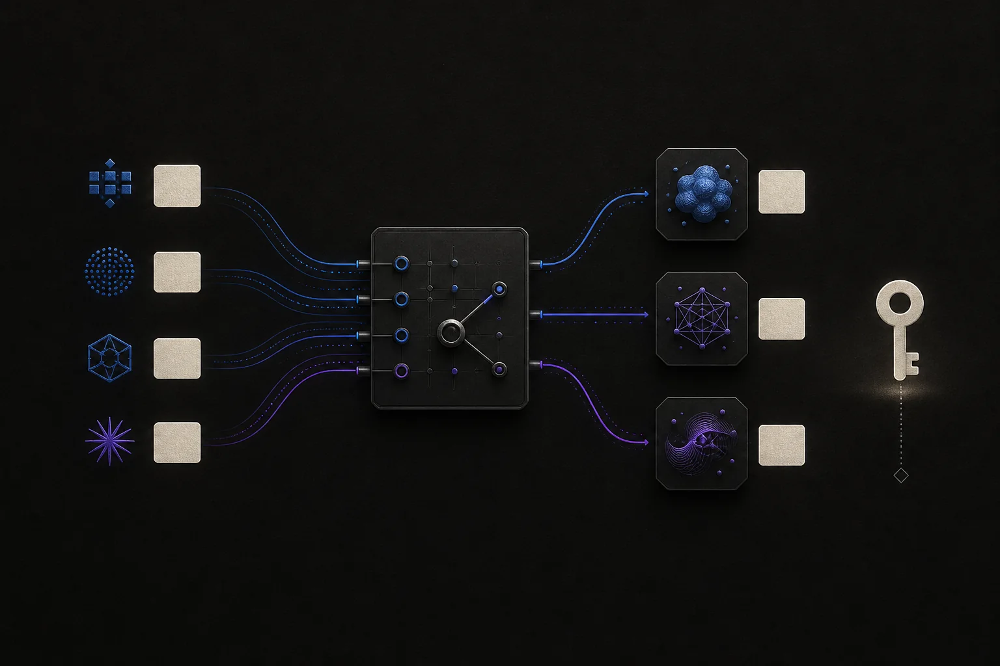

<p align="center">
  
</p>

<h1 align="center">@bytetrue/pi-vendor</h1>

<p align="center">AI-first provider and model management for Pi's <code>models.json</code>.</p>

<p align="center">
  <a href="https://www.npmjs.com/package/@bytetrue/pi-vendor"></a>
</p>

The package uses an on-demand Skill for routine work and keeps `/vendor` as a small cold-start wizard for the moment when no usable model exists. It registers no permanent Agent tools.

## Install

```bash
pi install npm:@bytetrue/pi-vendor
```

Restart or reload Pi. Configuration lives at `$PI_CODING_AGENT_DIR/models.json`, or `~/.pi/agent/models.json` by default.

## Ask Pi

The bundled `pi-vendor` Skill is discovered automatically. Ask naturally:

- “Add `claude-opus-4-5` to provider `my-gateway` using Anthropic's official template.”
- “Discover the models exposed by `my-gateway`.”
- “Update this provider's base URL without changing its API key.”
- “Audit my Pi model configuration.”
- “Remove model `old-model` from provider `local`.”

The Skill uses Pi's normal read/edit flow, so changes stay narrow and inspectable. It never invents model cost, context, capabilities, or compatibility metadata when no authoritative source provides them.

> [!CAUTION]
> When a working Agent is available, never paste an API key into chat. Let the Skill give you the bundled `vendor.mjs set-key` command, then run it yourself; terminal input is hidden and the key never enters argv or the assistant response. The cold-start `/vendor` key field is visible while typing, so do not use it while sharing or recording your terminal.

## Cold-start setup

Run `/vendor` when no working model is available or when you prefer a manual path:

1. **Add provider** — provider key, base URL, API format, API key, and first model.
2. **Add model** — choose an existing provider, then discover or enter a model id.

Each run adds exactly one provider or model and exits. Use `←`/`→` to page model candidates and `↑`/`↓` to move. `Esc` cancels without writing.

Successful saves are atomic, use file mode `0600`, refresh Pi's model registry, and report any runtime validation error.

## On-demand helper

The Skill calls one bundled script only when needed:

| Command | Purpose |
| --- | --- |
| `vendor.mjs catalog <query>` | Search credential-free templates from the active Pi installation |
| `vendor.mjs discover <provider> [configured-model]` | Probe the effective OpenAI, Anthropic, or Google model-list route and return ids |
| `vendor.mjs lint` | Check local JSON shape and duplicate model ids |
| `vendor.mjs set-key <provider>` | Privately update one provider key from the user's terminal |

Discovery accepts only HTTP(S), rejects redirects and credential-bearing URLs, and applies fixed time/body limits. A returned id is positive evidence; an unlisted configured id is only a warning to verify, never proof that the upstream does not support it.

## Safety boundaries

`/vendor` and `set-key` use strict JSON handling and atomic `0600` writes. Their core operations reject stale revisions and identity conflicts instead of silently upserting or overwriting them.

The Skill uses Pi's normal read/edit tools rather than that transaction core; review its diff, then let it run the bundled local `lint` check.

Across both paths:

- official templates never copy credentials or routing fields into the target provider;
- the target provider and template source remain separate choices;
- there is no Web UI, background server, OAuth manager, or general mutation tool.

API keys are stored as literals in `models.json`, matching Pi's native configuration. Keys containing Pi metacharacters are escaped before storage so Pi cannot expand or execute them.

## Development

```bash
npm --workspace @bytetrue/pi-vendor run typecheck
npm --workspace @bytetrue/pi-vendor test
npm --workspace @bytetrue/pi-vendor pack --dry-run
```

Use an isolated `PI_CODING_AGENT_DIR` for tests and smoke runs. They must never read or write the user's Pi configuration.

Requires `@earendil-works/pi-coding-agent >=0.79.10`.
